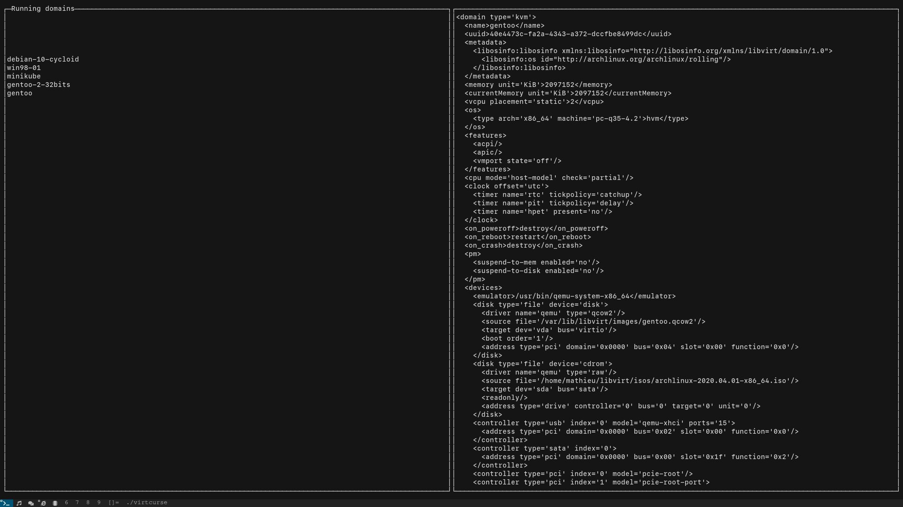

## VirtCurse

[](https://pkg.go.dev/github.com/tormath1/virtcurse)

:warning: :construction: it's heavily under-construction :construction: :warning:

Manage your hypervisor from a curses interface using Libvirt APIs and its [supported](https://libvirt.org/drivers.html) drivers.

### Usage

```
$ virtcurse help
manage your hypervisor from a curses interface using Libvirt APIs
and supported drivers: https://libvirt.org/drivers.html

Usage:
  virtcurse [flags]
  virtcurse [command]

Available Commands:
  help        Help about any command
  version     Prints the current build version

Flags:
  -h, --help                 help for virtcurse
      --libvirt-uri string   virsh connect URI (default "qemu:///system")
      --log log-file         enable logging in the log-file
      --log-file string      path to store the logs (default "./virtcurse.log")
```

### Screenshot

<p align="center">
  
</p>

### Build

To build `virtcurse` (:warning: `libvirt-dev` is required)

```
make
```
